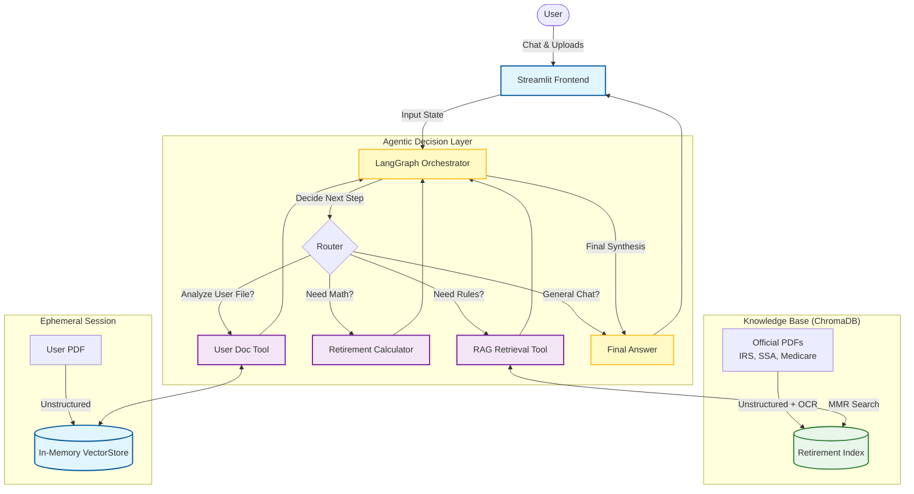

# 🤖 GenAI Retirement Advisor

**An Agentic RAG application that provides grounded, accurate retirement planning advice by synthesizing official government documentation (SSA, IRS, Medicare) with precise mathematical modeling.**

---

## 🧠 Architecture

This system uses a **Multi-Agent architecture** orchestrated by **LangGraph**. Unlike traditional linear RAG chains, this agent dynamically routes user queries to specific tools based on intent—performing searches for policy questions, executing Python code for math, or analyzing user-uploaded documents on the fly.

Key Features
Agentic Routing: Uses GPT-4o to intelligently distinguish between queries requiring semantic search (policies) vs. deterministic calculation (savings growth).

Domain-Specific RAG: Grounded in a curated vector database of official PDFs (IRS Pub 590, SSA Handbook), minimizing hallucinations.

Hybrid Ingestion Pipeline: * Uses unstructured with Tesseract OCR (strategy='hi_res') for complex tables.

Implements Recursive Character Splitting for text-heavy sections.

Personalized Document Analysis: Users can upload their own 401(k) statements; the system builds an ephemeral vector index for that session to answer personal questions.

Safety & Compliance: Custom personas (Retiree vs. Financial Planner) with strict system prompts to enforce citation of sources.

🛠️ Tech Stack
Orchestration: LangChain, LangGraph

LLM: OpenAI GPT-4o / GPT-3.5-turbo

Vector Database: ChromaDB (Persistent & In-Memory)

Ingestion: Unstructured, Tesseract OCR, Poppler

Frontend: Streamlit

DevOps: Docker, GitHub Actions (CI/CD)

🚀 Getting Started
Prerequisites
Python 3.10+

Tesseract OCR installed on your system (Required for PDF parsing).

Windows: Installer (Add to PATH)

Linux: sudo apt-get install tesseract-ocr

Installation
Clone the repository

Bash

git clone [https://github.com/yourusername/retirement-genai-advisor.git](https://github.com/yourusername/retirement-genai-advisor.git)
cd retirement-genai-advisor
Install Dependencies

Bash

pip install -r requirements.txt
Configuration Create a .env file in the root directory:

Ini, TOML

OPENAI_API_KEY=sk-your-key-here
Ingest Data (Build the Brain) Run the ingestion pipeline to parse PDFs and populate ChromaDB.

Bash

python src/ingest_all.py
Run the Application

Bash

streamlit run app.py
🐳 Docker Deployment
The application is fully containerized for production deployment.

Bash

# Build the image
docker build -t retirement-advisor .

# Run the container
docker run -p 8501:8501 --env-file .env retirement-advisor
📂 Project Structure
Plaintext

├── .github/workflows/   # CI/CD Pipelines
├── chroma_db/           # Persistent Vector Database
├── data/
│   └── raw/             # Official PDFs (IRS, SSA, etc.)
├── src/
│   ├── graph.py         # LangGraph Orchestrator definition
│   ├── ingest_all.py    # ETL Pipeline
│   ├── tools_rag.py     # Retrieval Tools
│   ├── tools_math.py    # Python Calculation Tools
│   ├── tools_user.py    # Dynamic User Document Tool
│   └── personas.py      # System Prompts & Personas
├── app.py               # Streamlit Frontend
├── Dockerfile           # Production Image Config
└── requirements.txt     # Python Dependencies

🛡️ License
This project is for educational and portfolio purposes. Not financial advice.